GETTING STARTED WITH HASHICORP VAULT ON MICROSOFT AZURE
*******************************************************
It's no secret that storage and management of sensitive data can be complicated and cumbersome. HashiCorp designed Vault to 
help ease the burden we all face in dealing with passwords and general secrets management. It's an open source tool that can
be used across providers - cloud, dedicated, and on premise alike. If your needs include a higher level of organizational 
complexity, they've also built out an Enterprise version of Vault that offers fine-grained control around governance and 
compliance. Today we'll take a look at using the open source version of HashiCorp Vault on Microsoft Azure.

We'll start from the beginning - what is HashiCorp Vault? In our day to day lives we work with many types of data 
that could benefit from a solution that handles sensitive data in a secure and reliable way. HashiCorp Vault is a secrets 
management and storage engine. It allows you to store, access, and distribute sensitive secrets in a secure and reliable way.
If you're wondering what a secret is, it's any bit of sensitive data that you need to store and use securely. Think passwords,
certificates, tokens - really anything that you don't want laying out in the open within your environment. Gone are they days 
of trying to determine where you should hide keys, certificates, and passwords on your servers to obfuscate them from your 
application while still allowing access to them when needed in a secure fashion.

So, that sounds awesome - but if you're not storing those things on servers next to the applications that need them, how does a 
solution like this work? Vault works as a central storage engine for your secrets. You authenticate to your Vault server 
just as you would authenticate to other web applications. Vault has a concept of auth methods which include things like username 
and password, LDAP, Active Directory. It also ships with auth methods that work with cloud providers like Azure, AWS, and Google - 
and there is even a GitHub auth method! Using any of the auth methods available that you have configured
(more information here: https://www.vaultproject.io/docs/auth/index.html), you would simply connect to and authenticate with your 
Vault server, receive a token, and then you'd have the ability to generate secrets, store secrets, or retrieve secrets. You can 
connect to Vault using the REST API via HTTP requests or through the Vault command line tool that ships within the binary. Using 
the Azure auth method, Azure can act as a trusted third party to Vault. You can then use a JWT token that has been signed by 
Azure Active Directory to authenticate.

If you are brand new to HashiCorp Vault, it's a good idea to start with what is called the Vault dev server. This allows you to use
Vault to become more familiar with the ins and outs of how secrets are generated, stored, and retrieved before building out Vault
in a highly available production configuration. One word of caution before we get into setting up your first Vault dev server - 
*DO NOT* use the dev server for Vault in production! The dev server is really only meant for testing and getting used to Vault. 
The Vault dev server should *never* be used in any meaningful production capacity. Now that we have that out of the way, let's get 
our HashiCorp Vault dev server up and running!

I've installed Vault locally on my Mac using Homebrew (https://brew.sh). 

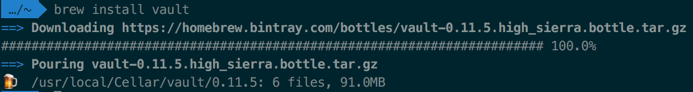

Vault is available for Windows, Linux, and Mac (among other OSes) as a simple binary. The downloads for Vault can be found here: 
https://www.vaultproject.io/downloads.html 

For the purposes of this HashiCorp Vault dev server demo, I've created a small (Standard B1s) Azure virtual machine running 
Ubuntu 18.04. I've configured it so that I can access the server via SSH and HTTP/HTTPS from my local workstation. I'm going to
start by logging into this server and installing Vault there. You'll want to make sure the `vault` binary is available in the `PATH`.
For my example, I've simply moved the `vault` binary into `/usr/local` as it was already in my `PATH`. You could also symlink there
instead if you'd like, but this was a quick and effective option for my purposes here.

When you run `vault`, you should see usage and command output from the binary. You can also run `vault version` to see the current
version of Vault that you're working with. If either of these commands fail and you receive an error saying the binary could not
be found, double check that your `PATH` contains the directory where you've installed the `vault` binary.

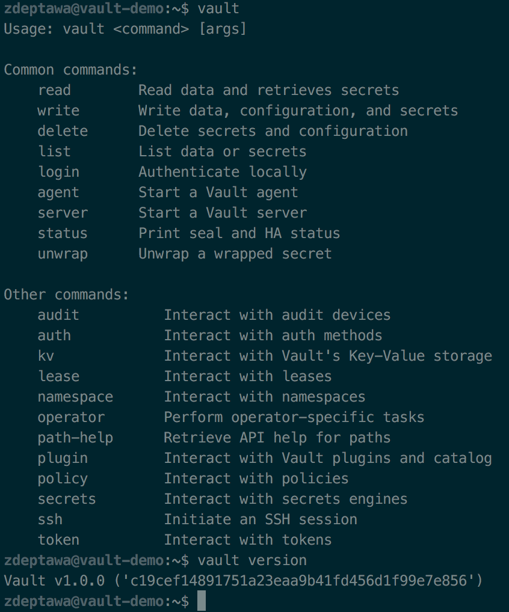

Vault is now installed! As a bonus, if you're running Bash, ZSH, or Fish, you can install command-line tab completion for Vault. To
do so, simply run `vault -autocomplete-install` and restart your terminal or reload your shell. Once done, you can use `vault <tab>`
to see suggestions of options to run.

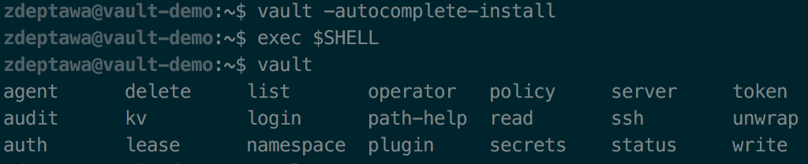

Now that we have Vault installed we can start the dev server. Being Vault doesn't fork, I'm going to start the dev server in a screen
session. You can alternatively start it in your current terminal and open a separate session if you'd prefer. The command to start
the Vault dev server is `vault server -dev`.

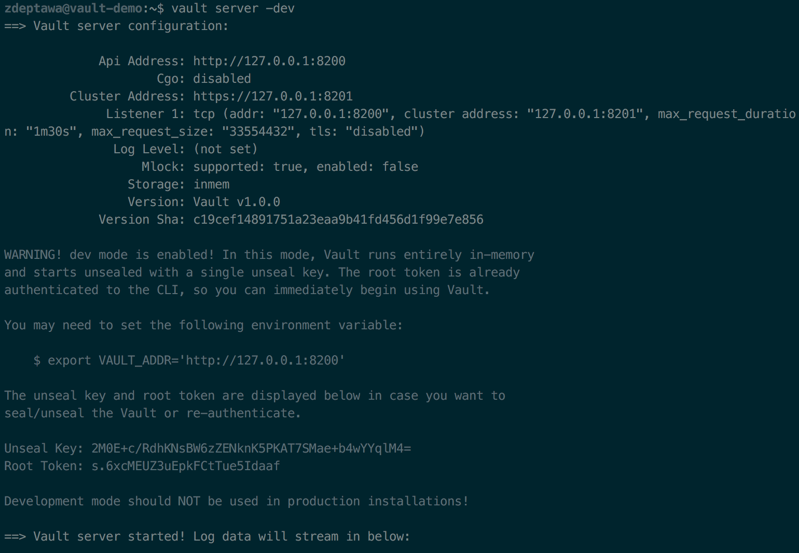

You can see that we now have a running Vault dev server! I'm going to save three pieces of information from this screen session
before I detach from my screen session - the `export VAULT_ADDR` line, the `Unseal Key`, and the `Root Token`. The 
`export VAULT_ADDR` line will configure the Vault client to talk to my now running dev server. We will also export the `Root Token` 
as `VAULT_DEV_ROOT_TOKEN_ID` for use with the client. Once we've exported those two values, a `vault status` will confirm that 
we can now connect to the running Vault dev server!

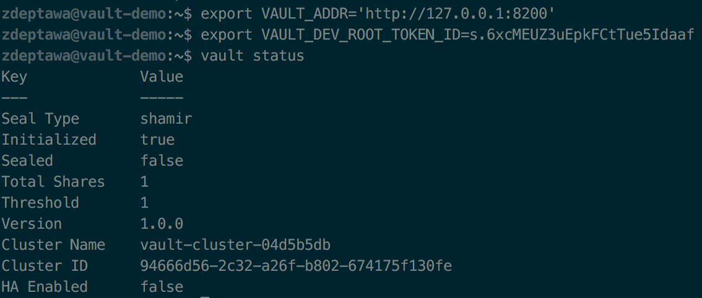

Congrats! You've got a running Vault dev server! Let's try storing a secret. When a secret is written to Vault, it is first
encrypted and then written to Vault's back-end storage. For the Vault dev server, back-end storage is only in-memory - but a 
typical production configuration of Vault would use on-disk storage or HashiCorp Consul. It's important to note that Vault
encrypts the value before the storage driver ever sees it. The back-end storage will never see the value unencrypted and doesn't 
have the capability of decrypting it without Vault interaction. To write a secret to Vault via the command line, we can use the
`vault kv` command. I'm going to store a key pair to a secret called `vault`. For this example, `isawesome` is my key and 
`totesobvi` is my value. You can use any secret name and key pair you'd like - just make sure to remain consistent with the 
secret and key pair names you choose moving forward with this guide. You also want to make sure you prefix your secret name with
`secret/` as this is where arbitrary secrets can be stored and accessed.

Success! You can see from the output that Vault has stored my new secret. Let's run `vault kv get` to see what it stored.

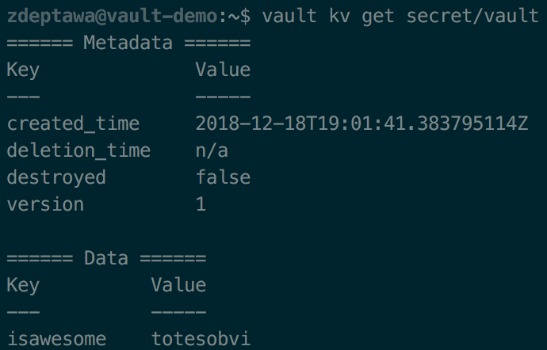

The `vault kv get` command shows us what is stored in the secret - but it also shows us some metadata as well that covers when
the secret was created as well as the version of that secret. Let's change the value of our secret.

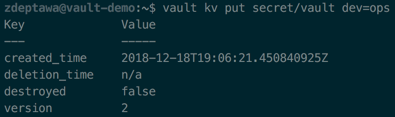

As you can see, I've changed to a new key `dev` with a value of `ops` in my `secret/vault`. You can also see it incremented the 
version of this secret. Let's see what a `vault kv get` shows now.

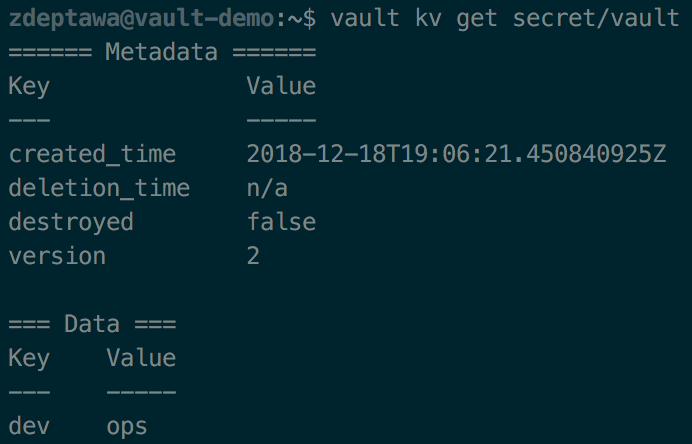

We can see that it completely overwrote this secret and my `isawesome=totesobvi` key is no longer there. What if I wanted to store
both key pairs in this secret? Let's try a `vault kv put` with both key pairs with a `vault kv get` just after.

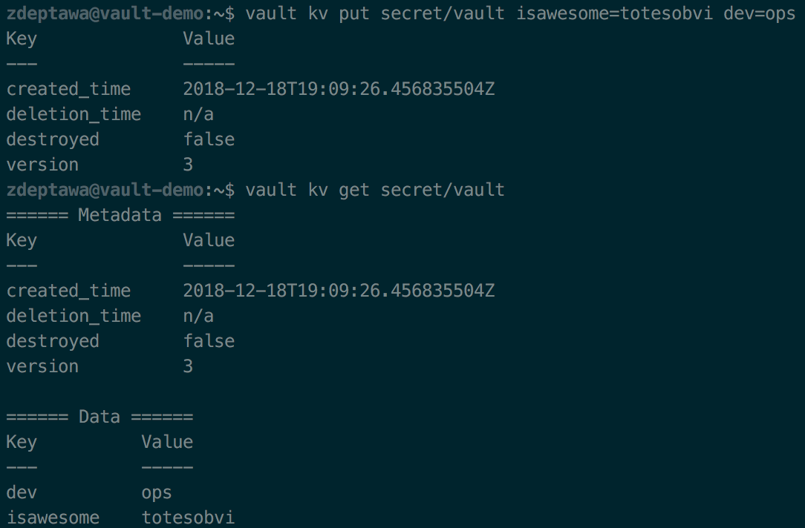

As you can see, Vault has incremented the version of my secret and now shows both key pairs under the same secret. You can also
set a format switch if you'd like to have the output in a format like JSON.

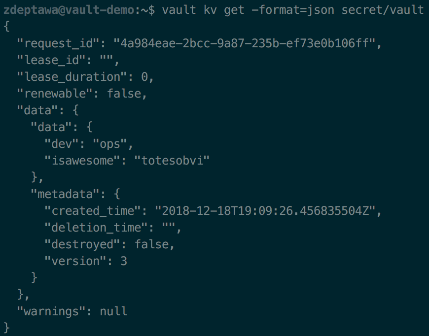

If we want to delete a secret, we can do so with `vault kv delete`. Let's do that now.

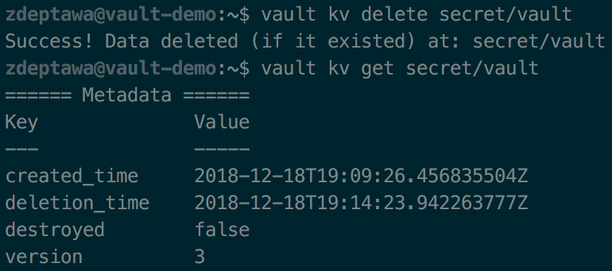

As you can see from the `vault kv get` command, the secret is now deleted and shows a deletion time. For this getting started 
example, we've been using the Key/Value (kv for short) secrets engine - but there are many different secrets engines you can
use, and each of them can be enabled or disabled as needed. For example, HashiCorp Vault has an Azure secrets engine that can 
dynamically generate Azure Service Principals and Role Assignments. This allows you to create Service Principals that are
associated with a Vault lease. When that lease expires, the service principal is automatically deleted. 

Enabling different secrets engines in Vault is also simple. To enable the Azure secrets engine, you'd run 
`vault secrets enable azure`. You can then configure the secrets engine using `vault write azure/config` where you'd set 
`subscription_id`, `tenant_id`, `client_id`, and `client_secret`. If you happen to be running Vault on an Azure virtual machine 
with Managed Service Identity(MSI) enabled, you can omit the `client_id` and `client_secret` settings. From here, you can begin 
configuring roles using Vault. We won't go into this in detail here, but more information on the Azure secrets engine for Vault
can be found here: https://www.vaultproject.io/docs/secrets/azure/index.html 
More information on all of  HashiCorp Vault's secrets engines can be found here: https://www.vaultproject.io/docs/secrets/

Ok - so we've started a Vault dev server and we've connected to it using the `vault` CLI tool - but when did we actually
authenticate against Vault? When we started the Vault dev server with `vault server -dev`, it printed out our `Root Token`.
We then exported that token as well as the localhost address for Vault and used the CLI to connect to it. The `Root Token` is
the initial access token that is used to configure vault. As its name implies, it has root privileges and can perform any operation
within Vault. While you can use `vault token create` to create other tokens that can be used to authenticate, this is not considered
a best practice for users or applications that need to write or retrieve secrets. It is far more secure to use other auth methods 
such as the Azure or GitHub auth methods to authenticate with your Vault server.

NEXT STEPS:
- Learn about different secrets engines
- Explore other auth methods
- Check out using the HTTP REST API
- Link to hardening Vault and best practices
